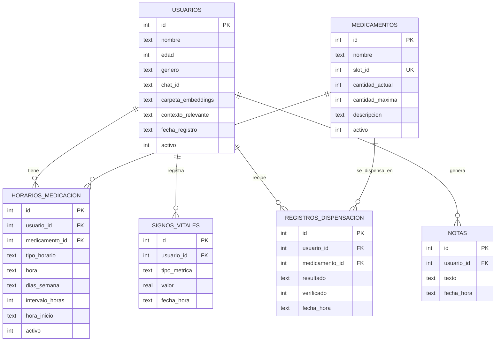

# MEADLEASE (Koda) — Base de datos

## 1. Introducción

- **Motor:** SQLite (`database/meadlease.db`)
- **Acceso desde código:** exclusivamente a través de las herramientas/funciones del agente (`robot_cognition`) — nunca acceso directo a la BD desde otros módulos.

---

## 2. Diagrama Entidad-Relación



### Sobre las relaciones

Todas las relaciones del esquema son **1 a N**, con una excepción conceptual importante:

- **`usuarios` ↔ `medicamentos` es en realidad una relación N a N** (un usuario toma varios medicamentos; un medicamento puede estar en el horario de varios usuarios). Como esta relación tiene atributos propios (`tipo_horario`, `hora`, `dias_semana`, etc.), no se resuelve con una tabla puente vacía de dos columnas, sino con **`horarios_medicacion` como entidad asociativa completa**, con su propio `id` y su propio significado clínico. Esta es la pieza central que separa "qué hay en el carrusel" (`medicamentos`) de "quién lo necesita y cuándo" (`horarios_medicacion`).
- El resto de relaciones son 1 a N simples y directas desde `usuarios` o `medicamentos` hacia sus tablas de historial/registro.

---

## 3. Detalle por tabla

### 3.1 `usuarios`

| Columna | Tipo | Nota |
|---|---|---|
| `id` | INTEGER PK AUTOINCREMENT | Identificador interno, referenciado por las demás 5 tablas |
| `nombre` | TEXT NOT NULL | Cómo lo llama el agente en conversación |
| `edad` | INTEGER | Contexto conversacional (tono, forma de dirigirse) — no se usa para lógica médica automática |
| `genero` | TEXT | Para que el agente use el género correcto en español ("listo/lista", "él/ella") |
| `chat_id` | TEXT | Contacto de emergencia — puede ser distinto por usuario, ya que cada uno puede tener un cuidador/familiar diferente |
| `carpeta_embeddings` | TEXT | Ruta a la carpeta de fotos/embeddings faciales (ej. `embeddings/usuario_{id}/`). NULL al crear el usuario, se llena tras el registro facial |
| `contexto_relevante` | TEXT | Perfil de personalidad/gustos (color favorito, equipo de fútbol, actividades) — alimentado por la herramienta `update_user_context`, distinto de la bitácora situacional en `notas` |
| `fecha_registro` | TEXT DEFAULT (datetime('now','localtime')) | Trazabilidad de alta, costo casi nulo de mantener |
| `activo` | INTEGER DEFAULT 1 | Baja lógica — no se usa en la demo pero evita perder historial si algún día se retira un usuario |

**"Usuarios" y no "pacientes":** Koda es un robot doméstico de acompañamiento, no un dispositivo médico clínico (ver ADR-030 en `DECISIONES_TECNICAS.md`).

**Flujo de creación:** el `id` autoincremental se genera primero (sin `carpeta_embeddings`); solo después se nombra la carpeta como `embeddings/usuario_{id}/` y se actualiza la columna — coincide con el flujo del HMI (datos primero, registro facial después).

**`contexto_relevante` vs. `notas`:** el primero es un perfil estable de gustos/preferencias (se sobrescribe vía `update_user_context`); `notas` es una bitácora cronológica situacional/médica (vía `save_note`). Separar las tools evita ambigüedad sobre cuál debe invocar el LLM en cada caso.

---

### 3.2 `medicamentos`

| Columna | Tipo | Nota |
|---|---|---|
| `id` | INTEGER PK AUTOINCREMENT | Referenciado por `horarios_medicacion` y `registros_dispensacion` |
| `nombre` | TEXT NOT NULL | String completo, sin separar dosis (ej. "Losartán 50mg") — decisión de simplicidad |
| `slot_id` | INTEGER NOT NULL UNIQUE | Compartimento físico del carrusel dispensador |
| `cantidad_actual` | INTEGER NOT NULL DEFAULT 0 | Se decrementa en cada dispensación exitosa, verificada por `pastilla_verificada` (ESP32-CAM vía `RESP_DISPENSE`) |
| `cantidad_maxima` | INTEGER NOT NULL | Solo para referencia visual en el HMI (nivel de llenado). Se recalcula al alza si una recarga posterior ingresa más cantidad que la máxima registrada — no tiene ninguna otra lógica de negocio asociada |
| `descripcion` | TEXT | Opcional. Ingreso manual, texto simple ("para la presión arterial") — **nunca autogenerada** vía consulta a fuentes externas/web |
| `activo` | INTEGER DEFAULT 1 | Permite retirar un medicamento del catálogo sin perder el historial de dispensaciones que ya lo referencian |

**El catálogo se liga al carrusel, no al usuario:** `medicamentos` modela el inventario físico real; es `horarios_medicacion` la que le da significado clínico por usuario (ver relación N a N en §2). Por eso `slot_id` es único e independiente del usuario — dos usuarios que comparten medicamento comparten físicamente el mismo compartimento.

**Rango válido de `slot_id`:** el carrusel tiene 6 compartimentos (dato mecánico de Linda, sujeto a cambio). Se valida en código, no con `CHECK` en SQL, para no requerir migración si cambia.

**`descripcion` es manual, nunca autogenerada:** consultar una API o web introduciría texto no curado (dosis, contraindicaciones) que comprometería el validador ético estructural (`ROBOT_COGNICION.md`, Módulo 2).

**`cantidad_maxima`:** solo alimenta una barra de nivel en el HMI (`list_medications`); no dispara comportamiento proactivo del agente.

---

### 3.3 `horarios_medicacion`

| Columna | Tipo | Nota |
|---|---|---|
| `id` | INTEGER PK AUTOINCREMENT | |
| `usuario_id` | INTEGER NOT NULL FK → `usuarios(id)` | |
| `medicamento_id` | INTEGER NOT NULL FK → `medicamentos(id)` | |
| `tipo_horario` | TEXT NOT NULL | `'diario'` \| `'dias_semana'` \| `'intervalo'` — discriminador que determina qué columnas siguientes aplican |
| `hora` | TEXT | Formato `HH:MM`. Usada en modo `diario` y `dias_semana` |
| `dias_semana` | TEXT | CSV simple (ej. `"1,3,5"`, L=1...D=7). Solo aplica en modo `dias_semana`, NULL en los otros dos |
| `intervalo_horas` | INTEGER | Solo modo `intervalo` (ej. `8` para "cada 8 horas"). NULL en los otros dos |
| `hora_inicio` | TEXT | Solo modo `intervalo` — punto de partida del ciclo. NULL en los otros dos |
| `activo` | INTEGER DEFAULT 1 | Permite desactivar un horario sin borrarlo (ej. tratamiento suspendido temporalmente) |

**Una sola tabla con discriminador, no tres tablas por modo:** evita complicar el cálculo de "próxima dosis" y duplicar la relación N-a-N en cada tabla, sin beneficio real para el volumen de un prototipo (ver ADR-031).

**Lógica de cada modo** (relevante para `get_next_dose`):
- **`diario`** y **`dias_semana`**: una fila por horario (2 tomas al día = 2 filas).
- **`intervalo`**: una sola fila representa el patrón completo (ej. "cada 8h desde las 6:00"); la próxima dosis se calcula en código sobre `hora_inicio` + `intervalo_horas`.

El cálculo de próxima dosis vive en código, no en el LLM, para evitar alucinaciones temporales (mismo principio en `ROBOT_COGNICION.md`). `dias_semana` es CSV plano (no máscara de bits) por legibilidad. Restricción de negocio validada en código: un usuario+medicamento tiene un solo patrón de horario vigente a la vez. Diseño de la pantalla de ingreso: ver `ROBOT_HMI.md`.

---

### 3.4 `signos_vitales`

| Columna | Tipo | Nota |
|---|---|---|
| `id` | INTEGER PK AUTOINCREMENT | |
| `usuario_id` | INTEGER NOT NULL FK → `usuarios(id)` | |
| `tipo_metrica` | TEXT NOT NULL | `'bpm'` \| `'spo2'` \| `'temperatura'` |
| `valor` | REAL NOT NULL | Un solo tipo numérico para las 3 métricas — simplifica la columna, cubre tanto enteros (bpm, spo2) como decimales (temperatura) |
| `fecha_hora` | TEXT NOT NULL DEFAULT (datetime('now','localtime')) | Base de la vista de tendencias en el tiempo (HMI, Módulo 5B) |

**Formato "largo" (una fila por métrica), no "ancho":** el protocolo UART permite pedir una sola métrica (`kind=0/1/2`) o las 3 juntas (`kind=3`); una fila = una métrica evita columnas NULL y sigue siendo fácil de agrupar para tendencias. Cuando se pide `kind=3`, se insertan 3 filas con el mismo timestamp.

No hay columna `fuera_de_rango`: se calcula en código contra rangos de referencia de la capa de aplicación, así el dato crudo queda limpio y reutilizable si esos rangos cambian. `tipo_metrica` es TEXT libre (solo 3 valores, validados en código) en vez de tabla de catálogo — sería sobre-ingeniería. Descartado deliberadamente: columna `origen` (programada vs. bajo demanda), sin uso real para el prototipo.

---

### 3.5 `registros_dispensacion`

| Columna | Tipo | Nota |
|---|---|---|
| `id` | INTEGER PK AUTOINCREMENT | |
| `usuario_id` | INTEGER NOT NULL FK → `usuarios(id)` | Quién recibió (o debía recibir) la dispensación |
| `medicamento_id` | INTEGER NOT NULL FK → `medicamentos(id)` | |
| `resultado` | TEXT NOT NULL | `'exito'` \| `'no_cae_pastilla'` \| `'pastilla_incorrecta'` \| `'fallo_succion'` \| `'usuario_no_reconocido'` |
| `verificado` | INTEGER | Booleano, de `pastilla_verificada` (ESP32-CAM). **NULL** cuando `resultado='usuario_no_reconocido'`, ya que en ese caso nunca se llega a generar una trama UART real |
| `fecha_hora` | TEXT NOT NULL DEFAULT (datetime('now','localtime')) | |

**Se registra cada intento, no solo los éxitos:** útil para depurar el mecanismo físico y dar contexto al agente sobre fallos recientes. Los primeros 4 valores de `resultado` mapean 1 a 1 con el campo `resultado uint8` de `RESP_DISPENSE` (`HARDWARE_FIRMWARE.md`). El quinto valor, `'usuario_no_reconocido'`, no tiene trama UART asociada (la verificación de identidad ocurre en software antes de enviar `CMD_DISPENSE`), pero se registra igual para trazabilidad completa de intentos no autorizados.

---

### 3.6 `notas`

| Columna | Tipo | Nota |
|---|---|---|
| `id` | INTEGER PK AUTOINCREMENT | |
| `usuario_id` | INTEGER NOT NULL FK → `usuarios(id)` | |
| `texto` | TEXT NOT NULL | Contenido libre, sin categorización — decisión deliberada de simplicidad |
| `fecha_hora` | TEXT NOT NULL DEFAULT (datetime('now','localtime')) | |

**Propósito:** bitácora situacional/médica generada por `save_note(usuario_id, text)` — información puntual ("durmió mal", "se golpeó la cabeza"), timestamped, historial completo. Distinta de `usuarios.contexto_relevante` (perfil de personalidad, ver §3.1). No tiene columna de categoría por simplicidad — el LLM infiere relevancia leyendo el texto directamente.

**Ventana de contexto:** el agente consulta las notas de los **últimos 3 días** (tope 5-8 notas). Una ventana de tiempo, no un conteo fijo, evita que una nota importante de ayer se pierda por notas triviales generadas hoy.

Query de referencia:
```sql
SELECT * FROM notas
WHERE usuario_id = ?
  AND fecha_hora >= datetime('now', '-3 days')
ORDER BY fecha_hora DESC
LIMIT 8;
```

---

## 4. Pasos de creación manual (DB Browser for SQLite)

Orden de creación — respeta las dependencias de claves foráneas: `usuarios` y `medicamentos` no dependen de nadie, deben crearse primero.

1. Crear `meadlease.db` como archivo nuevo en `database/`.
2. Crear tabla `usuarios` (sin FKs).
3. Crear tabla `medicamentos` (sin FKs).
4. Crear tabla `horarios_medicacion` (FK → `usuarios`, FK → `medicamentos`).
5. Crear tabla `signos_vitales` (FK → `usuarios`).
6. Crear tabla `registros_dispensacion` (FK → `usuarios`, FK → `medicamentos`).
7. Crear tabla `notas` (FK → `usuarios`).
8. Verificar las relaciones en la pestaña "Database Structure" de DB Browser (columna "Foreign Keys").
9. Escribir y ejecutar (opcional) unos pocos `INSERT` de prueba para validar visualmente el esquema antes de escribir código de aplicación.

## 5. Exportación del esquema

Una vez creadas todas las tablas a mano, exportar el DDL resultante a `database/schema.sql` usando la función nativa de DB Browser (`File → Export → Database to SQL file`, o `Export Schema as SQL`). Esto es solo un respaldo versionado en git del diseño ya hecho a mano — no reemplaza ni automatiza el proceso de diseño, que ocurrió íntegramente por decisión manual, tabla por tabla.

---

## 6. Pendientes conocidos (no bloqueantes)

- Confirmar con Linda el número real de compartimentos del carrusel (asumido en 6 por ahora), para ajustar la validación de `slot_id` en código.
- Definir el mecanismo exacto de recarga de inventario (quién actualiza `cantidad_actual`/`cantidad_maxima` y desde dónde — probablemente una pantalla del HMI, no una tool del agente, ya que es una operación física realizada por un humano).