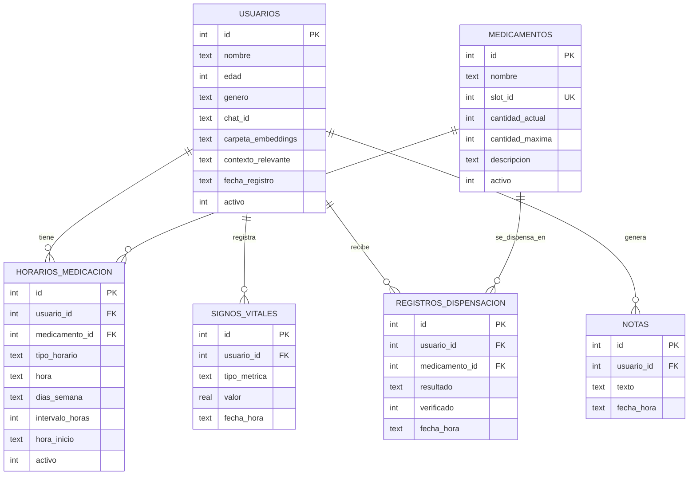

# MEADLEASE (Koda) — Base de datos

- **Motor:** SQLite (`database/meadlease.db`, fuera de git porque contiene datos personales). El esquema versionado está en [`schema.sql`](schema.sql).
- **Acceso:** una capa de acceso común (módulo Python compartido) que usan el agente (vía sus tools) y el HMI (dashboard, horarios, inventario). Ningún otro módulo toca la BD.
- **Idioma:** tablas, columnas y valores (`'temperatura'`, `'exito'`...) en español. Es una excepción a la regla de "código en inglés"; el código Python los mapea donde haga falta.
- **Cómo se creó:** a mano, tabla por tabla, en DB Browser for SQLite (primero `usuarios` y `medicamentos`, que no tienen FKs), y luego se exportó el DDL a `schema.sql`.

## Diagrama entidad-relación



La pieza central es `horarios_medicacion`: resuelve la relación N a N entre usuarios y medicamentos, y como esa relación tiene datos propios (modo, horas, días), es una tabla completa y no un simple puente. Así se separa "qué hay en el carrusel" (`medicamentos`) de "quién lo necesita y cuándo" (`horarios_medicacion`). Las demás relaciones son 1 a N.

Todas las tablas usan `id INTEGER PK AUTOINCREMENT` y fechas como `TEXT` con `datetime('now','localtime')` por defecto.

## Tablas

### `usuarios`

| Columna | Nota |
|---|---|
| `nombre` | Cómo lo llama el agente |
| `edad`, `genero` | Contexto para el tono y el género gramatical en español ("listo/lista"). No se usan para lógica médica |
| `chat_id` | Telegram del cuidador de ese usuario (cada uno puede tener uno distinto) |
| `carpeta_embeddings` | Ruta tipo `embeddings/usuario_{id}/`. NULL hasta que se hace el registro facial: primero se crean los datos y después la cara |
| `contexto_relevante` | Perfil de gustos (comida, equipo de fútbol...). Lo sobrescribe `update_user_context` |
| `activo` | Baja lógica, para no perder historial |

`contexto_relevante` es un perfil estable que se sobrescribe; `notas` es una bitácora con fecha. Están separadas para que el LLM no dude qué tool usar. Por qué "usuarios" y no "pacientes": ADR-030.

### `medicamentos`

| Columna | Nota |
|---|---|
| `nombre` | Texto completo con dosis, ej. "Losartán 50mg" |
| `slot_id` | Compartimento del carrusel (único). Hoy son 6; el rango se valida en código para no migrar si cambia |
| `cantidad_actual` | Baja con cada dispensación exitosa y verificada por la ESP32-CAM |
| `cantidad_maxima` | Solo para la barra de nivel del HMI; sube si una recarga la supera |
| `descripcion` | Opcional y siempre escrita a mano. Nunca se autogenera desde la web, para no meter información médica sin revisar |
| `activo` | Retira un medicamento sin perder su historial |

El catálogo representa el carrusel físico, no a un usuario: si dos usuarios toman lo mismo, comparten compartimento.

### `horarios_medicacion`

| Columna | Nota |
|---|---|
| `tipo_horario` | `'diario'` · `'dias_semana'` · `'intervalo'` (ADR-031) |
| `hora` | `HH:MM`, para `diario` y `dias_semana` |
| `dias_semana` | CSV, ej. `"1,3,5"` (L=1…D=7). Solo `dias_semana` |
| `intervalo_horas`, `hora_inicio` | Solo `intervalo` (ej. cada 8 h desde las 06:00) |
| `activo` | Suspende un horario sin borrarlo |

En `diario` y `dias_semana` hay una fila por toma (2 tomas al día = 2 filas). En `intervalo`, una sola fila describe todo el patrón. La próxima dosis se calcula en código, no en el LLM. Regla validada en código: un usuario+medicamento tiene un solo patrón vigente.

### `signos_vitales`

| Columna | Nota |
|---|---|
| `tipo_metrica` | `'bpm'` · `'spo2'` · `'temperatura'` (validado en código) |
| `valor` | `REAL`, sirve para las 3 métricas |
| `fecha_hora` | Base de las tendencias del HMI |

Una fila por métrica: si se miden las 3 juntas, son 3 filas con el mismo timestamp. No hay columna `fuera_de_rango`: se calcula en código, así el dato crudo sigue sirviendo si cambian los rangos.

### `registros_dispensacion`

| Columna | Nota |
|---|---|
| `resultado` | `'exito'` · `'no_cae_pastilla'` · `'pastilla_incorrecta'` · `'fallo_succion'` · `'usuario_no_reconocido'` |
| `verificado` | La ESP32-CAM confirmó la pastilla. NULL si el usuario no fue reconocido (nunca se dispensó) |

Se guarda cada intento, no solo los exitosos: sirve para depurar el mecanismo y para que el agente sepa de fallos recientes. Los 4 primeros resultados los reporta la ESP32 Médica; `usuario_no_reconocido` lo genera el software antes de dispensar.

### `notas`

Bitácora libre con fecha que escribe `save_note` ("durmió mal", "se golpeó la cabeza"). No tiene categorías: el LLM interpreta el texto.

El agente lee las notas de los últimos 3 días (máximo 8). Son valores iniciales, a ajustar. Se usa una ventana de tiempo y no un número fijo de notas para que una nota importante de ayer no la tapen las triviales de hoy:

```sql
SELECT * FROM notas
WHERE usuario_id = ?
  AND fecha_hora >= datetime('now', '-3 days')
ORDER BY fecha_hora DESC
LIMIT 8;
```

## Pendientes

- Confirmar con Linda cuántos compartimentos tiene el carrusel (hoy se asumen 6).
- Definir cómo se recarga el inventario: probablemente una pantalla del HMI y no una tool del agente, porque es una tarea física que hace una persona.
